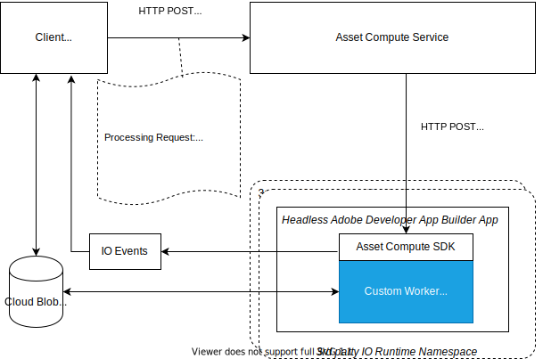

# Detalles internos de una aplicación personalizada {#how-custom-application-works}

Utilice la siguiente ilustración para comprender el flujo de trabajo de extremo a extremo cuando un cliente procesa un recurso digital mediante una aplicación personalizada.



*Figura: Pasos involucrados al procesar un recurso mediante Adobe [!DNL Asset Compute Service].*

## Registro {#registration}

El cliente debe llamar a [`/register`](api.md#register) una vez antes de la primera solicitud a [`/process`](api.md#process-request) para poder configurar y recuperar la dirección URL del diario para recibir eventos de Adobe [!DNL I/O Events] para Adobe Asset Compute.

```sh
curl -X POST \
  https://asset-compute.adobe.io/register \
  -H "x-ims-org-id: $ORG_ID" \
  -H "x-gw-ims-org-id: $ORG_ID" \
  -H "Authorization: Bearer $JWT_TOKEN" \
  -H "x-api-key: $API_KEY"
```

La biblioteca JavaScript [`@adobe/asset-compute-client`](https://github.com/adobe/asset-compute-client#usage) se puede usar en aplicaciones NodeJS para controlar todos los pasos necesarios desde el registro, el procesamiento y la administración asincrónica de eventos. Para obtener más información sobre los encabezados requeridos, consulte [Autenticación y autorización](api.md).

## Procesamiento {#processing}

El cliente envía una solicitud [procesando](api.md#process-request).

```sh
curl -X POST \
  https://asset-compute.adobe.io/process \
  -H "x-ims-org-id: $ORG_ID" \
  -H "x-gw-ims-org-id: $ORG_ID" \
  -H "Authorization: Bearer $JWT_TOKEN" \
  -H "x-api-key: $API_KEY" \
  -d "<RENDITION_JSON>
```

El cliente es responsable de dar formato correcto a las representaciones con direcciones URL firmadas previamente. La biblioteca JavaScript [`@adobe/node-cloud-blobstore-wrapper`](https://github.com/adobe/node-cloud-blobstore-wrapper#presigned-urls) se puede usar en aplicaciones NodeJS para firmar previamente las direcciones URL. Actualmente, la biblioteca solo admite el almacenamiento de Azure Blob y los contenedores de AWS S3.

La solicitud de procesamiento devuelve un(a) `requestId` que se puede usar para sondear [!DNL Adobe I/O] eventos.

A continuación encontrará un ejemplo de solicitud de procesamiento de aplicaciones personalizadas.

```json
{
    "source": "https://www.adobe.com/some-source-file.jpg",
    "renditions" : [
        {
            "worker": "https://my-project-namespace.adobeioruntime.net/api/v1/web/my-namespace-version/my-worker",
            "name": "rendition1.jpg",
            "target": "https://some-presigned-put-url-for-rendition1.jpg",
        }
    ],
    "userData": {
        "my-asset-id": "1234567890"
    }
}
```

[!DNL Asset Compute Service] envía las solicitudes de representación de aplicaciones personalizadas a la aplicación personalizada. Utiliza un POST HTTP para la URL de aplicación proporcionada, que es la URL de acción web segura de App Builder. Todas las solicitudes utilizan el protocolo HTTPS para maximizar la seguridad de los datos.

El [SDK de Asset Compute](https://github.com/adobe/asset-compute-sdk#adobe-asset-compute-worker-sdk) utilizado por una aplicación personalizada administra la solicitud HTTP POST. También controla la descarga del origen, la carga de representaciones, el envío de Adobe [!DNL I/O Events] y la gestión de errores.

<!-- TBD: Add the application diagram. -->

### Código de aplicación {#application-code}

El código personalizado solo necesita proporcionar una llamada de retorno que tome el archivo de origen disponible localmente (`source.path`). `rendition.path` es la ubicación donde se colocará el resultado final de una solicitud de procesamiento de recursos. La aplicación personalizada usa la llamada de retorno para convertir los archivos de origen disponibles localmente en un archivo de representación con el nombre pasado (`rendition.path`). Una aplicación personalizada debe escribir en `rendition.path` para crear una representación:

```javascript
const { worker } = require('@adobe/asset-compute-sdk');
const fs = require('fs').promises;

// worker() is the entry point in the SDK "framework".
// The asynchronous function defined is the rendition callback.
exports.main = worker(async (source, rendition) => {

    // Tip: custom worker parameters are available in rendition.instructions.
    console.log(rendition.instructions.name); // should print out `rendition.jpg`.

    // Simplest example: copy the source file to the rendition file destination so as to transfer the asset as is without processing.
    await fs.copyFile(source.path, rendition.path);
});
```

### Descargar archivos de origen {#download-source}

Una aplicación personalizada solo trata los archivos locales. [Asset Compute SDK](https://github.com/adobe/asset-compute-sdk#adobe-asset-compute-worker-sdk) se encarga de la descarga del archivo de origen.

### Creación de representación {#rendition-creation}

SDK llama a una función de devolución de llamada [rendition asincrónica](https://github.com/adobe/asset-compute-sdk#rendition-callback-for-worker-required) para cada representación.

La función de devolución de llamada tiene acceso a los objetos [source](https://github.com/adobe/asset-compute-sdk#source) y [rendition](https://github.com/adobe/asset-compute-sdk#rendition). `source.path` ya existe y es la ruta de acceso a la copia local del archivo de origen. `rendition.path` es la ruta de acceso donde se debe almacenar la representación procesada. A menos que se establezca el indicador [disableSourceDownload](https://github.com/adobe/asset-compute-sdk#worker-options-optional), la aplicación debe usar exactamente `rendition.path`. De lo contrario, SDK no puede localizar ni identificar el archivo de representación y falla.

La simplificación excesiva del ejemplo se realiza para ilustrar y centrarse en la anatomía de una aplicación personalizada. La aplicación solo copia el archivo de origen en el destino de la representación.

Para obtener más información sobre los parámetros de devolución de llamada de representación, consulte [API de Asset Compute SDK](https://github.com/adobe/asset-compute-sdk#api-details).

### Cargar representaciones {#upload-rendition}

Después de crear cada representación y almacenarla en un archivo con la ruta de acceso proporcionada por `rendition.path`, [Asset Compute SDK](https://github.com/adobe/asset-compute-sdk#adobe-asset-compute-worker-sdk) carga cada representación en un almacenamiento en la nube (AWS o Azure). Una aplicación personalizada obtiene varias representaciones al mismo tiempo si, y solo si, la solicitud entrante tiene varias representaciones que apuntan a la misma dirección URL de aplicación. La carga en el almacenamiento en la nube se realiza después de cada representación y antes de ejecutar la llamada de retorno para la siguiente representación.

`batchWorker()` tiene un comportamiento diferente. Procesa todas las representaciones y solo después de procesarlas todas, las carga.

## [!DNL Adobe I/O Events] {#aio-events}

SDK envía Adobe [!DNL I/O Events] para cada representación. Estos eventos son del tipo `rendition_created` o `rendition_failed`, según el resultado. Para obtener más información, consulte [Eventos asincrónicos de Asset Compute](api.md#asynchronous-events).

## Recibir [!DNL Adobe I/O Events] {#receive-aio-events}

El cliente sondea el diario de Adobe [!DNL I/O Events] según su lógica de consumo. La dirección URL inicial del diario es la proporcionada en la respuesta de API `/register`. Los eventos se pueden identificar usando el `requestId` que está presente en los eventos y es el mismo que se devolvió en `/process`. Cada representación tiene un evento independiente que se envía en cuanto se carga (o falla) la representación. Cuando recibe un evento coincidente, el cliente puede mostrar o administrar de otro modo las representaciones resultantes.

La biblioteca JavaScript [`asset-compute-client`](https://github.com/adobe/asset-compute-client#usage) simplifica el sondeo de diarios utilizando el método `waitActivation()` para obtener todos los eventos.

```javascript
const events = await assetCompute.waitActivation(requestId);
await Promise.all(events.map(event => {
    if (event.type === "rendition_created") {
        // get rendition from cloud storage location
    }
    else if (event.type === "rendition_failed") {
        // failed to process
    }
    else {
        // other event types
        // (could be added in the future)
    }
}));
```

Para obtener más información sobre cómo obtener eventos de diario, consulte Adobe [[!DNL I/O Events] API](https://developer.adobe.com/events/docs/guides/api/journaling-api#).

<!-- TBD:
* Illustration of the controls/data flow.
* Basic overview, in text and not code, of how an application works.
-->
